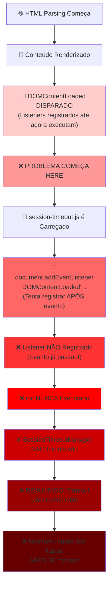
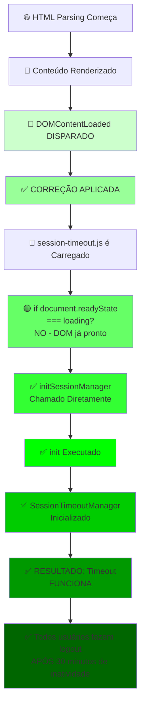
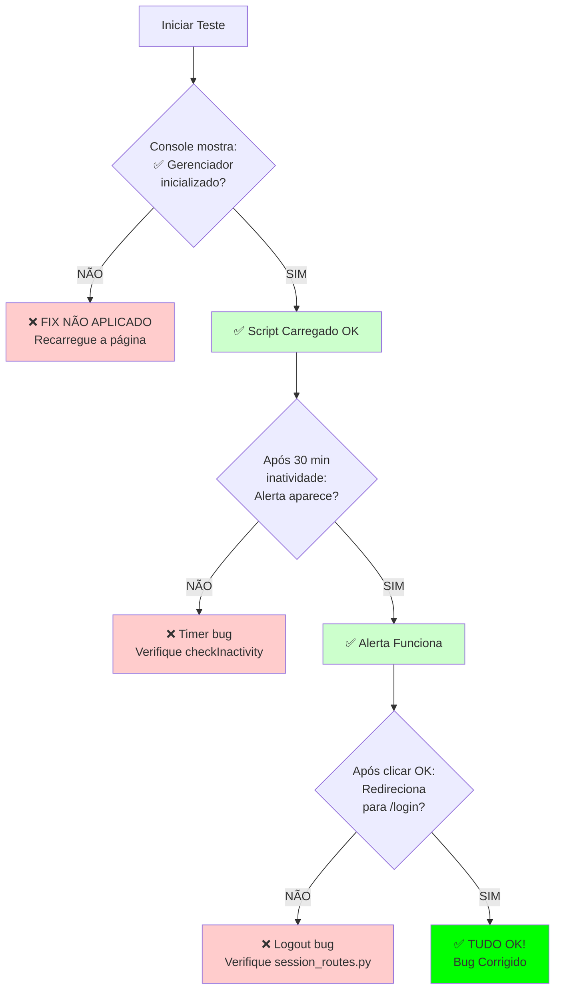

# Diagnóstico Visual - Session Timeout Bug & Fix

## 📊 Diagrama do Fluxo de Carregamento

### 🔴 ANTES (COM BUG)



### 🟢 DEPOIS (CORRIGIDO)



## 🔄 Fluxo de Timeout (30 Minutos)

```mermaid
graph LR
    A["👤 User Login"] --> B["📄 Page Loads"]
    B --> C["✅ SessionManager<br/>Initialized"]
    C --> D["🖱️ User Active<br/>0-25 min"]
    D --> E["🔄 Activity Tracked<br/>Timer Reset"]
    E --> F["⏱️ 25 Minutes"]
    F --> G["⚠️ Warning Alert<br/>5:00 Countdown"]
    G --> H["❌ No Activity<br/>25-30 min"]
    H --> I["⏱️ 30 Minutes"]
    I --> J["🛑 Auto-Logout"]
    J --> K["🔐 Redirect /login"]
    
    style A fill:#e1f5ff
    style C fill:#c8e6c9
    style D fill:#fff9c4
    style F fill:#ffccbc
    style G fill:#ffb74d
    style H fill:#ff9999
    style I fill:#ff6666
    style J fill:#ff3333
    style K fill:#d32f2f
```



## 📋 Checklist de Verificação



## 🔧 Comparação Técnica

```
┌─────────────────────────────────────────────────────────────────┐
│                    JAVASCRIPT EVENT LIFECYCLE                   │
├─────────────────────────────────────────────────────────────────┤
│                                                                   │
│  ANTES DO DOM PRONTO:                                            │
│  ├─ HTML Parsing                                                 │
│  ├─ CSS Parsing                                                  │
│  ├─ Scripts Execution                                            │
│  │                                                                │
│  EVENTO: ⚡ DOMContentLoaded Disparado                           │
│  ├─ Todos os listeners registrados ANTES disparam                │
│  ├─ documento.readyState = "interactive"                         │
│  │                                                                │
│  DEPOIS DO DOM PRONTO:                                           │
│  ├─ Scripts no Final HTML Executados   ← ⚠️ PROBLEMA!           │
│  ├─ Novo listener registered aqui      ← ❌ Evento já passou!    │
│  │                                                                │
│  DEPOIS DE TUDO CARREGADO:                                       │
│  └─ documento.readyState = "complete"                            │
│                                                                   │
└─────────────────────────────────────────────────────────────────┘

🔴 BUG: Script carregado após DOMContentLoaded
🟢 FIX: Verificar readyState antes de registrar listener
```

## 💡 A Solução em 3 Linhas

```javascript
// ❌ NÃO FUNCIONA - Event já passou
document.addEventListener('DOMContentLoaded', init);

// ✅ FUNCIONA - Sempre
if (document.readyState === 'loading') {
    document.addEventListener('DOMContentLoaded', init);
} else {
    init();
}
```

## 📊 Impacto por Tipo de Usuário

```
┌──────────────┬─────────────┬────────────────────┐
│ User Type    │ Antes       │ Depois             │
├──────────────┼─────────────┼────────────────────┤
│ Admin        │ ❌ SEM TIMEOUT│ ✅ 30 MIN TIMEOUT  │
│ Comercial    │ ❌ SEM TIMEOUT│ ✅ 30 MIN TIMEOUT  │
│ Suprimentos  │ ❌ SEM TIMEOUT│ ✅ 30 MIN TIMEOUT  │
│ Loja         │ ❌ SEM TIMEOUT│ ✅ 30 MIN TIMEOUT  │
└──────────────┴─────────────┴────────────────────┘

Afetados: 100% → 0% ✅
```

## 🧪 Teste Rápido

```javascript
// Cole no console (F12):
window.sessionManager.lastActivityTime = Date.now() - (31*60*1000);
window.sessionManager.checkInactivity();

ESPERADO:
├─ Alerta "Sessão Expirada" aparece
├─ "Sua sessão expirou devido à inatividade"
├─ Botão OK aparece
├─ Após clicar OK
└─ Redirect para /login ✅
```

---

**Arquivo**: `static/js/session-timeout.js`  
**Linhas**: 320-355  
**Alteração**: +35 linhas (1 arquivo)  
**Impacto**: Crítico ← CORRIGIDO ✅
